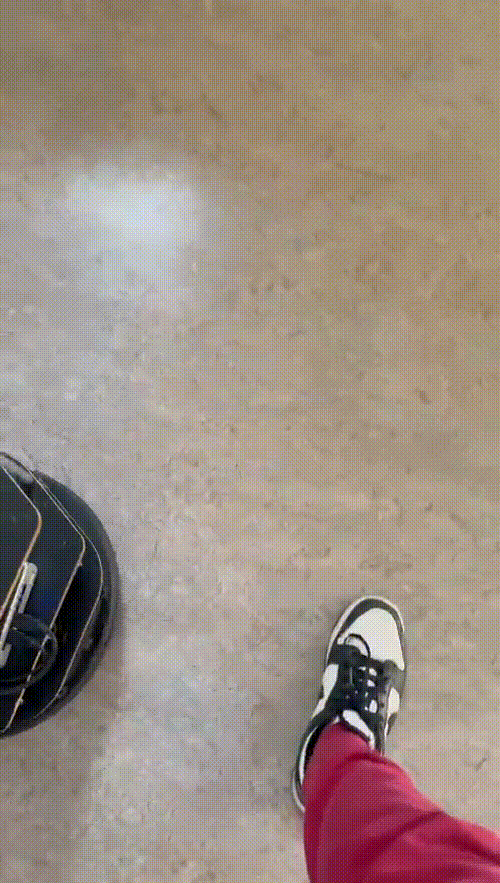

# mobile_robotiks
Learn how to program a two-wheeled robot to drive from point A to point B. To do this, you will use C++ and ROS 2.

Mobile Robots Practical Course (INF4362) from Eberhard Karls Universitat Tübingen, Germany | 2024.10- 2025.02

Supervisors:
Prof. Dr. Andreas Zell, Mr. Daniel Eisele, Thomas Gossard
